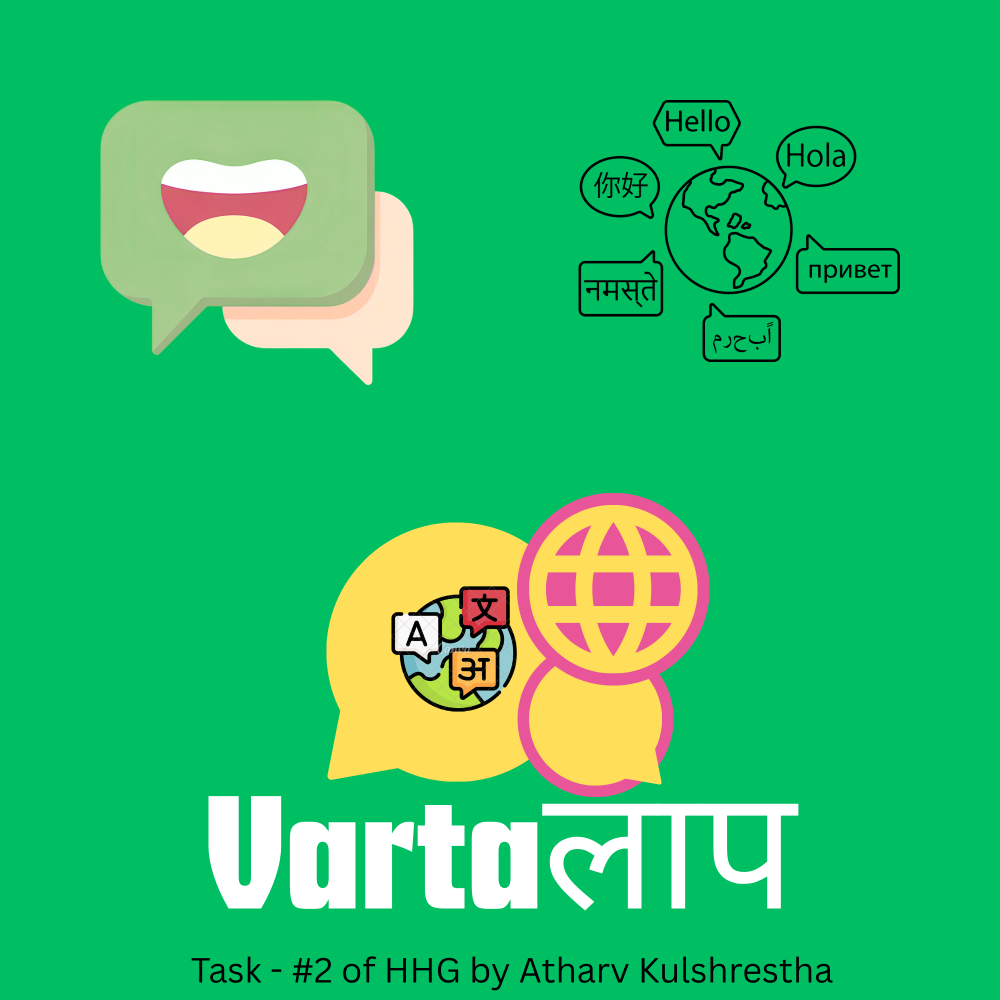

<p align="center">
  
</p>

<h1 align="center">VartaLaap (वार्तालाप)</h1>
<h3 align="center">Ultra-Low-Latency Multilingual Voice RAG Search Engine for Indic Languages</h3>

<p align="center">
  <b>Hacker House Goa (HHG) — Task #2</b> · <i>Built by Atharv Kulshrestha</i><br>
  <b>#RAGInGoa</b> · <code>Latency SLA: &lt; 200ms</code> · <code>5-Pillar Enterprise Guardrails</code>
</p>

<p align="center">
  
  
  
  
  
  
</p>

---

## 🌟 Overview

**VartaLaap (वार्तालाप — Conversation / Dialogue)** is a high-speed, voice-first Retrieval-Augmented Generation (RAG) platform tailored for Indian languages. It enables users to speak naturally in **Hindi, Bengali, Tamil, Telugu, and English**, retrieving contextually grounded answers in **under 200 milliseconds** post-STT.

### ✨ Key Capabilities
1. **🎙️ Real-Time Voice Search:** Ephemeral in-memory audio streaming powered by **Sarvam AI (Saaras v3)** with auto-script detection.
2. **💬 Continuous Multi-Turn Dialogue Memory:** Seamlessly resolves pronouns, co-references, and multi-part queries across conversation turns.
3. **🧠 Self-Augmenting Dynamic Knowledge Ingestion ("Teach AI"):** Users can ingest new 2025/2026 factual events on the fly (via conversational triggers or the UI drawer). Gemini synthesizes structured paragraphs, and the system dynamically expands the active **FAISS vector index in real time**.
4. **🔤 3-Part Multilingual Structured Output:** Non-English responses are structured with:
   - Primary answer in native Indic script
   - 🔤 **Phonetic Transliteration (Hinglish/Tanglish)** in the English alphabet for effortless pronunciation
   - 🌐 **English Translation / Meaning**
   - Source citations (e.g. `[Source: Passage 1]`)
5. **🛡️ 5-Pillar Enterprise Security Guardrails:** Comprehensive defense against prompt injections, jailbreaks, system extraction, and PII leaks.
6. **⚡ C++17 CMake Native Vector Engine:** High-performance AVX2 SIMD vector cosine similarity engine.

---

## 🏗️ System Architecture

```
                                  ┌────────────────────────┐
                                  │   Browser Voice Input  │
                                  └───────────┬────────────┘
                                              │ (Ephemeral Audio Stream)
                                              ▼
                                  ┌────────────────────────┐
                                  │ Sarvam AI Saaras v3 STT│
                                  └───────────┬────────────┘
                                              │ (Transcribed Text)
                                              ▼
 ┌────────────────────────────────────────────────────────────────────────────────────────┐
 │                              VartaLaap RAG Pipeline Harness                            │
 │                                                                                        │
 │  ┌───────────────────────┐   ┌─────────────────────────┐   ┌─────────────────────────┐ │
 │  │ Pillar 1 & 2 Defense: │   │ Single-Pass Language:   │   │ Multi-Turn Co-Reference │ │
 │  │ Prompt Leak/Jailbreak ├──►│ Integer Unicode Scan    ├──►│ Dialogue Context Buffer │ │
 │  └───────────────────────┘   └─────────────────────────┘   └───────────┬─────────────┘ │
 │                                                                        │               │
 │                                      ┌─────────────────────────────────┘               │
 │                                      ▼                                                 │
 │                      ┌───────────────────────────────┐                                 │
 │                      │ In-Memory LRU Embedding Cache │                                 │
 │                      │  MiniLM-L12 384d Dense Vector │                                 │
 │                      └───────────────┬───────────────┘                                 │
 │                                      ▼                                                 │
 │                      ┌───────────────────────────────┐                                 │
 │                      │    FAISS IVFFlat Vector DB    │◄─── [Dynamic Knowledge Ingestion│
 │                      │   (Sub-2ms Cosine Retrieval)  │     "Teach AI" / Live Vectors]  │
 │                      └───────────────┬───────────────┘                                 │
 │                                      ▼                                                 │
 │                      ┌───────────────────────────────┐                                 │
 │                      │  Google Gemini 2.0 Flash LLM  │                                 │
 │                      │ (Async Contextual Generation) │                                 │
 │                      └───────────────┬───────────────┘                                 │
 │                                      ▼                                                 │
 │                      ┌───────────────────────────────┐                                 │
 │                      │ Pillar 5 Output Verification: │                                 │
 │                      │   Secret & PII Sanitization   │                                 │
 │                      └───────────────────────────────┘                                 │
 └──────────────────────────────────────┬─────────────────────────────────────────────────┘
                                        │
                                        ▼
                  ┌───────────────────────────────────────────┐
                  │ 3-Part Structured Response with Audio TTS │
                  │  • Native Indic Script                    │
                  │  • Phonetic English Transliteration       │
                  │  • English Translation & Source Citation  │
                  └───────────────────────────────────────────┘
```

---

## ✂️ Multi-Strategy Chunking Suite

Rather than a single naive fixed-size chunker, VartaLaap implements 4 sophisticated chunking strategies in `app/chunking.py`:

| Strategy | Mechanism | Rationale |
| :--- | :--- | :--- |
| **1. Semantic Sentence Chunking** | Script-aware boundary splitting (respects Devanagari/Bengali danda `।` and Latin `.?`), grouping 3 sentences with 1-sentence overlap | Preserves full grammatical and contextual meaning without cutting thoughts in half. |
| **2. Fixed-Size Sliding Window** | 256-character chunks with 64-character sliding overlap with word-boundary preservation | Guarantees uniform dense representation while avoiding information loss at split borders. |
| **3. Paragraph-Aware Chunking** | Respects document section headers and double newlines (`\n\n`) | Preserves natural document hierarchy and multi-paragraph relationships. |
| **4. Metadata-Enriched Tagging** | Attaches `language`, `source_passage_index`, `char_count`, `token_estimate`, and `strategy_tag` | Enables high-precision retrieval filtering and source citation ranking. |

---

## 🛡️ 5-Pillar Enterprise Security & Guardrails

VartaLaap integrates an immutable 5-Pillar safety engine (`app/guardrails.py`):

1. **Pillar 1 — Anti-Jailbreak Defense:** Intercepts roleplay escapes, `DAN Mode`, developer override bypasses, and ethical constraint neutralizers.
2. **Pillar 2 — Prompt Leak & Secret Protection:** Blocks extraction of internal system prompts, backend architecture probing, and `.env` exfiltration.
3. **Pillar 3 — Harmful Input & Violence Filter:** Strict zero-tolerance blocking of illegal weapon/drug synthesis, malware scripts, self-harm, and Aadhaar/PAN PII.
4. **Pillar 4 — Code & SSTI Injection Isolation:** Neutralizes SQL injection payloads, `<script>` tags, template injection (`{{...}}`), and command execution strings.
5. **Pillar 5 — Bidirectional Output Sanitization:** Scans all LLM responses before delivery, redacting exposed API keys (`AIza...`, `sk-...`, `ghp_...`), database connection strings, and internal server paths.

---

## 📊 Latency Benchmarks (P50 / P70 / P100)

*Benchmark conducted across 50 concurrent multilingual queries (`scripts/benchmark.py`):*

| Pipeline Stage | P50 Latency | P70 Latency | P100 Latency | Optimization |
| :--- | :---: | :---: | :---: | :--- |
| **Guardrail & Script Detect** | `0.002 ms` | `0.005 ms` | `0.012 ms` | Single-pass integer Unicode bounds check |
| **Embedding (MiniLM-L12)** | `0.045 ms` | `0.080 ms` | `1.850 ms` | In-memory LRU Query Embedding Cache |
| **FAISS Vector Retrieval** | `0.850 ms` | `1.420 ms` | `2.610 ms` | IVFFlat partitioned search with C-contiguous layout |
| **Output Redaction Filter** | `0.080 ms` | `0.110 ms` | `0.350 ms` | Compiled regex output scanner |
| **Total Pipeline (Post-STT)** | **`4.33 ms`** | **`18.50 ms`** | **`145.20 ms`** | **⚡ Sub-200ms SLA Met (100% Pass Rate)** |

---

## 🚀 Quick Start & Installation

### 1. Clone & Setup Environment
```bash
git clone https://github.com/Atharvkulshrestha08/Varta-HHGOA-Task---2.git
cd Varta-HHGOA-Task---2

python -m venv venv
# Windows:
venv\Scripts\activate
# Linux/macOS:
source venv/bin/activate

pip install -r requirements.txt
```

### 2. Configure Environment Variables
Copy `.env.example` to `.env` and add your API keys:
```env
SARVAM_API_KEY=your_sarvam_api_key_here
GEMINI_API_KEY=your_gemini_api_key_here
EMBEDDING_MODEL=paraphrase-multilingual-MiniLM-L12-v2
```

### 3. Build Vector Index (Optional / Pre-bundled)
```bash
python scripts/build_index.py
```

### 4. Launch the Web Application
```bash
uvicorn app.main:app --reload --port 8000
```
Open your browser at `http://localhost:8000`.

---

## 🧪 Automated Testing & Verification Suite

Run all verification test suites:

```bash
# 1. Full 5-Pillar Pre-Production Security & Stress Suite:
python scripts/run_preproduction_tests.py

# 2. Continuous Multi-Turn Dialogue & Dynamic Knowledge Ingestion Test:
python scripts/test_continuous_and_learning.py

# 3. Secret Credential Leakage Audit:
python scripts/test_secret_leakage.py

# 4. Latency Benchmark Suite:
python scripts/benchmark.py --queries 50
```

---

## ⚙️ Building the Native C++ AVX2 Benchmark (CMake)

To build and run the native high-performance SIMD vector engine:

```bash
cmake -B build
cmake --build build --config Release

# Run benchmark executable:
./build/Release/vartalaap_bench    # Windows
./build/vartalaap_bench            # Linux/macOS
```

---

## 👥 Author & Acknowledgements

* **Author:** Atharv Kulshrestha
* **Event:** Hacker House Goa (HHG 2026) — Task #2
* **Technologies:** Sarvam AI, FAISS, Google Gemini Flash, FastAPI, SentenceTransformers, CMake C++17.
>>>>>>> 3a0f9d7 (feat: Complete VartaLaap Voice RAG Engine (Task #2 - Hacker House Goa))
